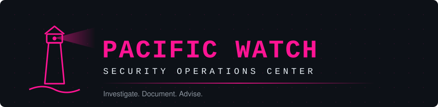
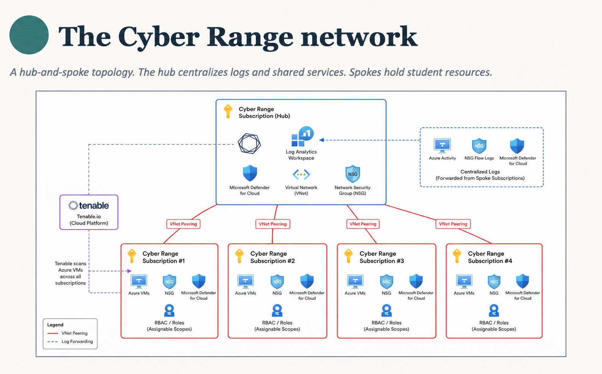
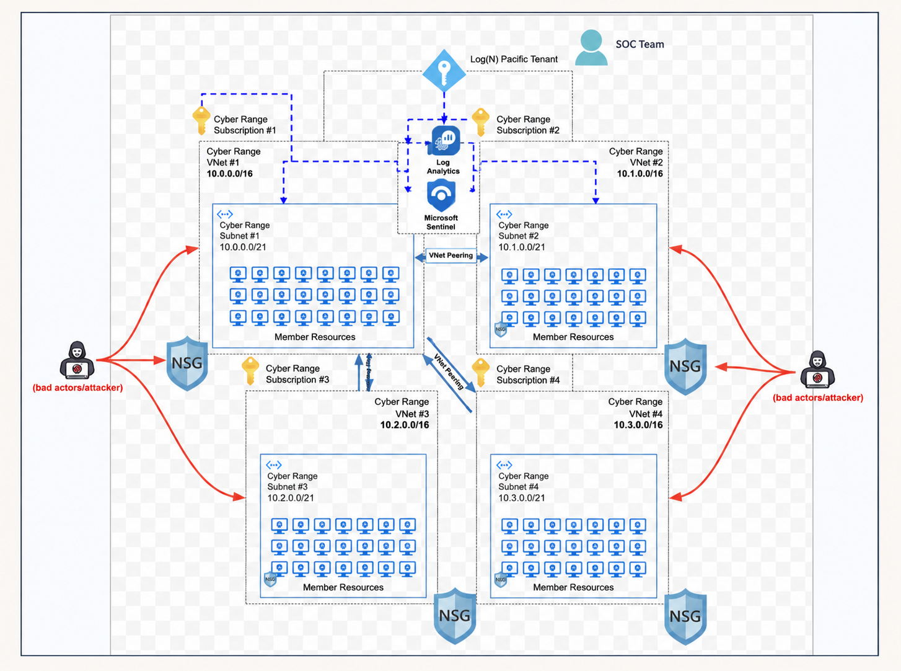
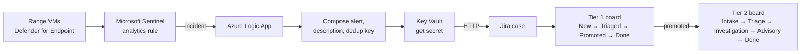
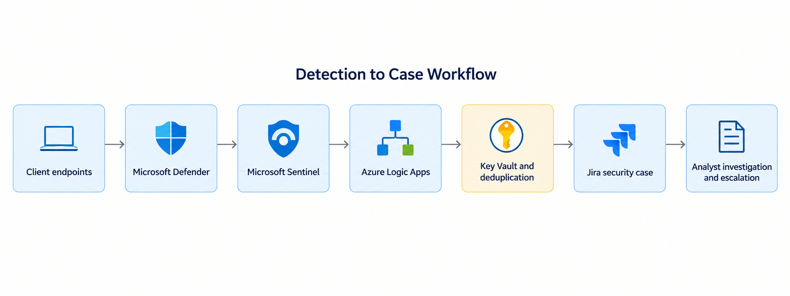
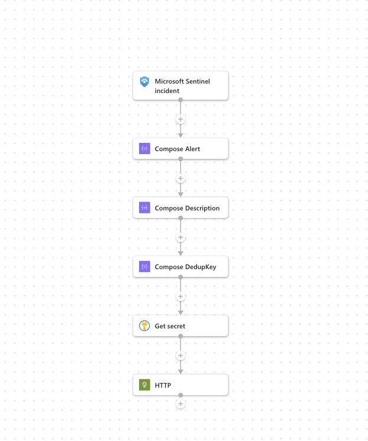
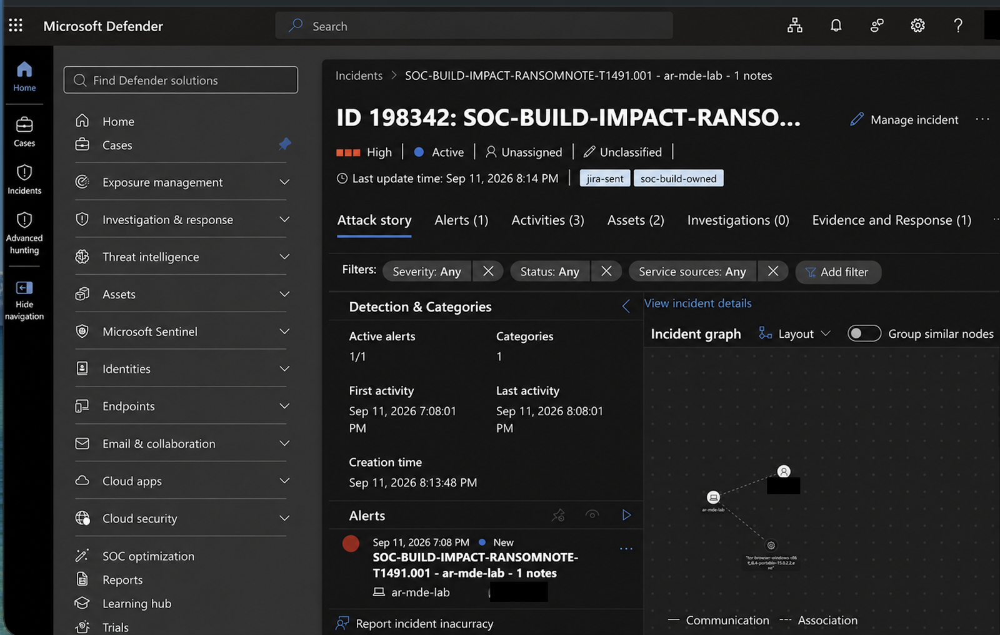
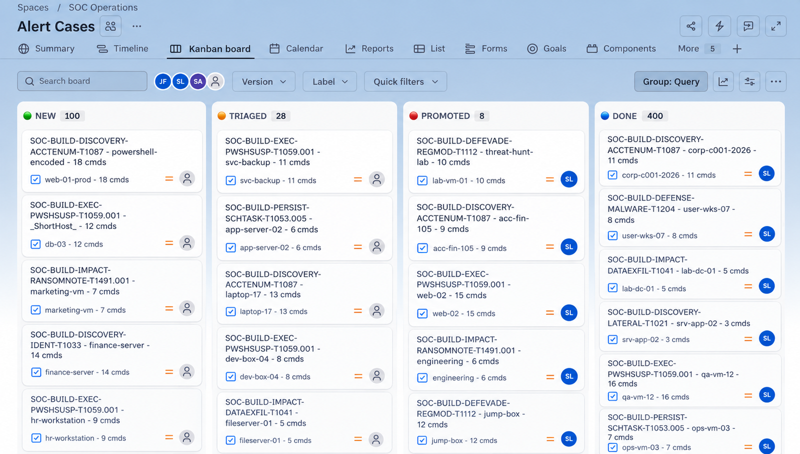
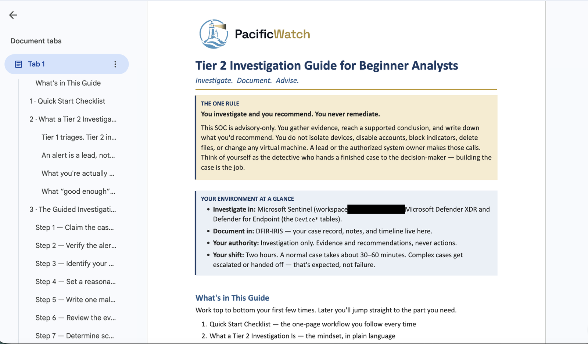

<p align="center">
  
</p>

# Pacific Watch SOC

***Investigate. Document. Advise.***

## What this project demonstrates

Pacific Watch is an advisory-only security operations center that I built and run on the Log(N) Pacific cyber range, a training environment where beginning analysts learn real SOC work. It shows how a SOC operates day to day: how a detection becomes a case, how a queue is triaged without drowning in false positives, how an investigation survives a shift change, and how findings reach the people who have to act on them. **The SOC observes, investigates, and recommends. It does not remediate.** Containment and fixes belong to the system owner or an authorized lead.

---

## My role and contributions

**Jenna Frank, Security Operations Manager.** I built the SOC and run it.

**Designed**
- The Jira case workflow and board.
- The escalation path, from analyst to Shift Lead to SOC Lead.
- The four-shift handoff ("baton-pass") process, so a case keeps moving across shifts without being rebuilt.
- The case-disposition taxonomy, the seven values of the `SOC - Disposition` field: True Positive – Malicious, Authorized Participant Activity, Authorized Simulated Activity, False Positive, Benign Positive, Insufficient Evidence, and Duplicate. Disposition and Triage Note are the only two fields an analyst enters on an Alert Case.
- The analyst progression ladder: T1 → T2 → Shift Lead → Specialization (detection engineer, threat hunter, or Head Investigator).

**Built or implemented**
- The SOC itself: queues, shifts, documentation standards, and the operating rules analysts work under.
- The Sentinel → Logic Apps → Jira case pipeline, including dedup keys and Key Vault secret handling.
- The promotion gate that came out of the 316-case flood: a rule reaches SOC-BUILD only with a threshold and a dedup key (see [case study 01](docs/case-studies/01-queue-flood-316-cases.md)).
- Fixes to the Logic App and detections so case titles carry the real host and count values.
- Helped write the detections and analyst playbooks.

**Led**
- A team of about 50 builders and 15 leaders across six teams.
- Recovery from the 316-case queue flood, cleared within 24 hours.

---

## Operational highlights

| | |
|---|---|
| **Range in scope** | Up to 1,500 virtual machines |
| **Team** | About 50 builders and 15 leaders across six teams |
| **Queue recovery** | 316 flood cases traced to unthresholded TEST brute-force rules; queue clear within 24 hours |
| **Noise reduction** | Alert volume fell from about 286 to 293 per day (Jul 12 to 15, 2026) to 8 per day by Jul 17 to 18 |
| **Authority** | Advisory only: investigate and recommend, never remediate |

---

## Architecture

The range uses a hub-and-spoke design. The hub subscription holds the shared Log Analytics workspace, Defender for Cloud, and Tenable scanning; each spoke subscription forwards its logs back to the hub.


<sub>Diagram: Log(N) Pacific Cyber Range.</sub>

Each spoke is its own VNet of member VMs behind an NSG. The VMs are exposed to the internet on purpose, and all of them report into Log Analytics and Microsoft Sentinel.


<sub>Diagram: Log(N) Pacific Cyber Range.</sub>

### Detection to case pipeline



---

## Alert → Investigation → Case → Handoff

**1. A detection fires.** Every detection follows one path from endpoint telemetry to an analyst's queue.


<sub>The path every case takes, from endpoint to analyst.</sub>

**2. The pipeline builds the case.** The Logic App composes the case, including a dedup key, and pulls its credential from Key Vault. Every rule must carry a dedup key before promotion to SOC-BUILD.


<br><sub>The Logic App playbook, from Sentinel trigger to Jira request.</sub>

**3. The incident is raised.** A SOC-built detection opens a High severity incident in Defender, tagged once its case is filed.


<sub>A SOC-built ransom note detection (T1491.001) with its case filed. User details redacted.</sub>

**4. The case enters the Tier 1 queue.** Alert Cases land on the Tier 1 board in New. Tier 1 triages each one, and cases that need deeper work are promoted to Tier 2, whose board runs Intake, Triage, Investigation, Advisory, and Done.


<sub>The Tier 1 Alert Cases board: New, Triaged, Promoted, Done. One title still shows an unfilled field (`_ShortHost_`); I traced that to the Logic App and detections not passing host and count values, and fixed both.</sub>

**5. An analyst investigates.** Tier 2 analysts follow a guided investigation that ends in a recommendation, not an action.


<sub>The Tier 2 playbook states the SOC's boundary. Workspace name redacted.</sub>

**6. The case is handed off.** If the case is still open at shift change, it moves to the next shift through a written handoff (see [Cross-shift case continuity](#cross-shift-case-continuity)).

---

## Selected case studies

- [01: The 316-case queue flood](docs/case-studies/01-queue-flood-316-cases.md). Unthresholded test rules flooded the queue at about 290 alerts a day; the rules were paused, the queue was clear in 24 hours, and the fix became a promotion requirement.
- [02: Suspicious enumeration that was an exercise](docs/case-studies/02-suspicious-enumeration-exercise.md). Scripted domain enumeration first looked like a participant's account; it was a staged scenario persona, confirmed with the scenario owner and dispositioned as Authorized Simulated Activity.

---

## Cross-shift case continuity

The SOC runs four shifts: Alpha, Bravo, Charlie, and Delta. An investigation that starts on one shift often finishes on another, so every open case is handed off in writing before the shift ends. The next analyst should be able to continue the investigation without rebuilding it.

Every handoff preserves:

- Case status
- Investigation summary
- Evidence reviewed
- Actions taken
- Open questions
- Escalations
- Current owner
- Next action

The full process, including the ticket format and quality standards, is in [docs/shift-handoff-process.md](docs/shift-handoff-process.md).

---

## Escalation

Knowing when to escalate, to whom, and with what context is part of the job. The [escalation matrix](docs/escalation-matrix.md) lists common situations, what a Tier 1 analyst does, who the case goes to, and the context they need to act on it. The permissions behind it are in [docs/rules-of-engagement.md](docs/rules-of-engagement.md).

---

## Detection engineering

The full standard, templates, and a self-audited worked example live in **[pacific-watch-detection-engineering](https://github.com/jennafrank/pacific-watch-detection-engineering)**.

- **SOC-TEST → SOC-BUILD promotion.** New rules start as SOC-TEST and are promoted to SOC-BUILD only once they have a threshold and a dedup key, so no unthresholded rule reaches the queue.
- **Detection Build Cards.** Each rule has a card that explains it in plain English: the attacker goal, where it looks, how often it runs, what trips it, what is excluded, and what the detection can and cannot see.
- **ATT&CK mapping.** Every rule name carries its tactic, behavior, and technique ID, for example `SOC-BUILD-PERSIST-RUNKEY-T1547.001`, so an analyst knows what the rule claims before opening the case.

---

## Documentation standards

> **If there is no ticket, it did not happen.**

Good case notes let the next analyst, shift, or team continue an investigation without rebuilding it from scratch.

---

## What building this taught me

- **A detection is only useful once someone can investigate and act on it.** A rule that fires into a queue nobody can work is noise with a timestamp.
- **The same behavior can be malicious, administrative, simulated, or expected.** The disposition comes from context, not from the alert name.
- **Noise is operational risk.** 316 cases from unthresholded test rules buried real work until the rules were paused.
- **Documentation is part of incident response.** If the next shift has to rediscover what you found, the investigation has stalled.
- **Escalation is a skill.** It means knowing who needs the case and what context they need to act on it.

---

## Technology stack


Cases are raised in Microsoft Defender and tracked in Jira. Case management is moving to DFIR-IRIS.

---

## Project structure

```
cyber-range-soc/
├── README.md
├── CONTRIBUTING.md                    Joining the team and picking up work
└── docs/
    ├── case-studies/                  Selected investigations
    ├── examples/                      Sample incident report
    ├── images/                        Diagrams and redacted screenshots
    ├── legacy/                        Superseded files from the GitHub issues era
    ├── escalation-matrix.md           Who gets a case, and what they need
    ├── onboarding.md                  Full onboarding guide
    ├── rules-of-engagement.md         What analysts may and may not do
    └── shift-handoff-process.md       Cross-shift handoff standard
```

---

## Contributing

New analysts start with [CONTRIBUTING.md](CONTRIBUTING.md): how to get access, pick a team, and pick up your first Jira ticket. Questions go to your Shift Lead.
