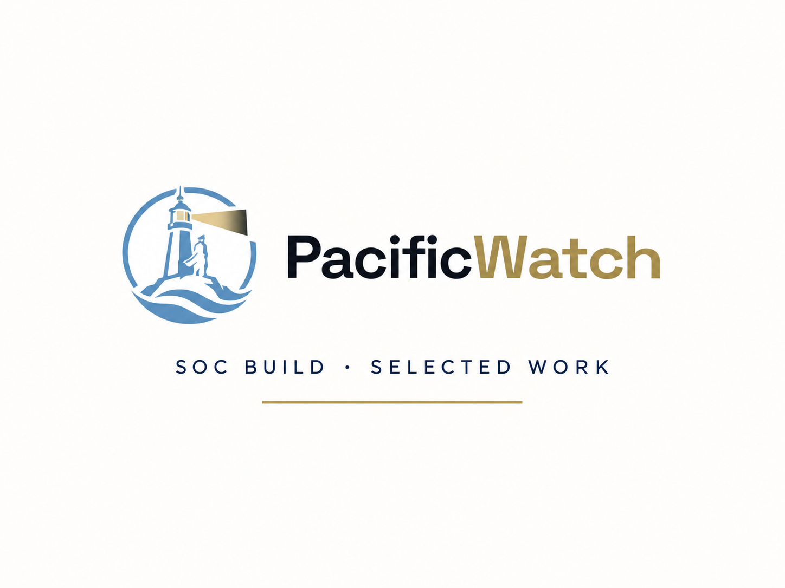
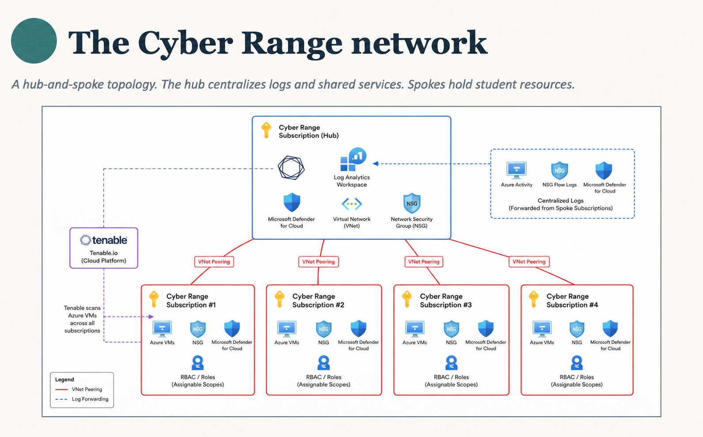
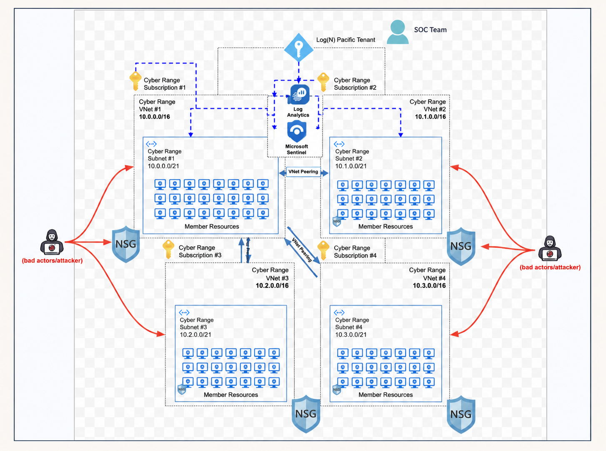
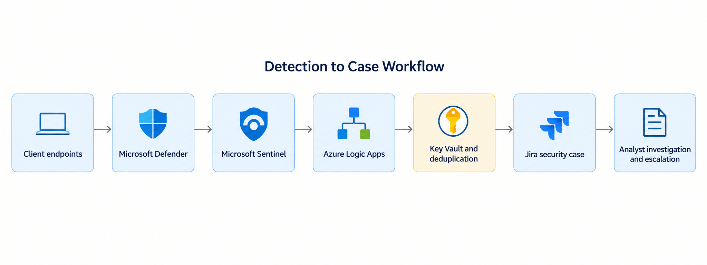
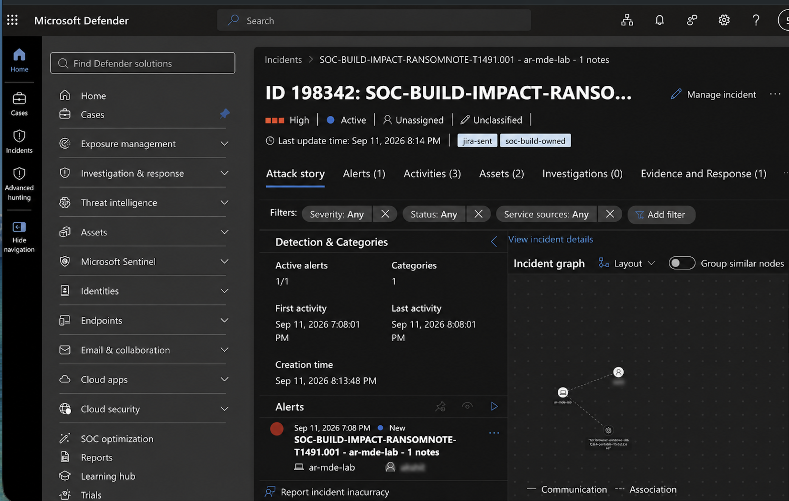
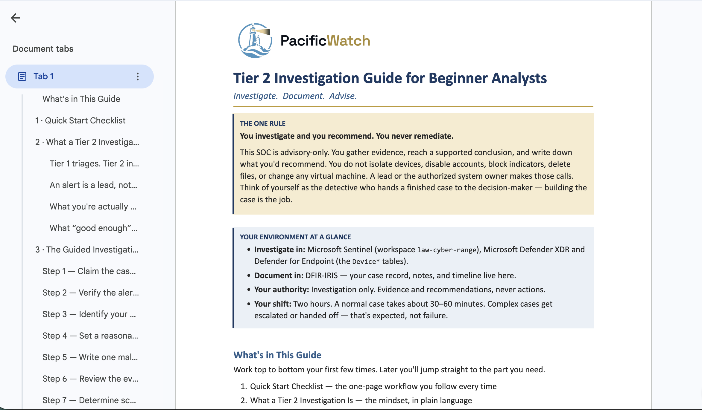

<p align="center">
  
</p>

# cyber-range-soc

Welcome to the **Cyber Range SOC**, a real-world security operations center built on a live, intentionally vulnerable environment. This is where analysts learn by doing, not by simulating.

---

## What Is This SOC?

This is a **tracking SOC, not a triage SOC.**

That distinction matters. We do not try to stop attackers, contain incidents, or remediate compromises. The environment is intentionally left vulnerable. Attackers are allowed in — and our job is to **observe, document, and understand everything they do after they get in.**

This means you will see real attacker behavior, real tooling, and real post-compromise activity. The goal is to build analyst skills, develop detections, and generate threat intelligence from live adversary operations — not to play defense.

If you are expecting to write firewall rules and block IPs, this is not that. If you want to understand how attackers actually move through an enterprise environment, you are in the right place.

---

## The Environment

The range runs entirely on **Microsoft Azure** and includes:

- **2,000+ virtual machines** across multiple network segments
- **Microsoft Sentinel** — SIEM and SOAR platform
- **Microsoft Defender for Endpoint** — endpoint telemetry and alerting
- **Tenable** — vulnerability management and asset visibility
- **Microsoft Entra ID** — identity and access management
- **MISP** — threat intelligence platform for sharing indicators and context
- **OpenCanary** — honeypot sensors distributed across the range
- **Azure Logic Apps** — automated workflows and playbook orchestration

The range uses a hub-and-spoke design. The hub subscription holds the shared Log Analytics workspace, Defender for Cloud, and Tenable scanning, and every spoke subscription forwards its logs back to it.

<p align="center">
  <br>
  <sub><em>Diagram: Log(N) Pacific Cyber Range</em></sub>
</p>

Each spoke is its own VNet and subnet full of member VMs behind an NSG. The VMs are exposed to the internet on purpose, and all of them report into Log Analytics and Microsoft Sentinel.

<p align="center">
  <br>
  <sub><em>Diagram: Log(N) Pacific Cyber Range</em></sub>
</p>

---

## From Alert to Case

Every detection follows the same path from an endpoint to an analyst.

<p align="center">
  
</p>

1. **Defender for Endpoint** collects telemetry from the range VMs.
2. **Sentinel** analytics rules turn that telemetry into incidents.
3. **An Azure Logic App** runs on each Sentinel incident. It builds the alert and description, computes a dedup key so the same activity doesn't open duplicate cases, pulls the ticketing credential from **Key Vault**, and opens the case over HTTP.
4. **Analysts** pick up the case, investigate, and escalate.

**Where cases live:** incidents are raised in **Microsoft Defender**, and all case tracking happens in **Jira**. Case management is moving to **DFIR-IRIS** soon.

<table>
  <tr>
    <td width="32%" valign="top"></td>
    <td valign="top"></td>
  </tr>
  <tr>
    <td valign="top"><em>The Logic App playbook, from trigger to ticket.</em></td>
    <td valign="top"><em>A live incident from a SOC-built detection (T1491.001), tagged <code>jira-sent</code> once the playbook has filed its case.</em></td>
  </tr>
</table>

---

## The Six Teams

The SOC is organized into six functional teams. Every contributor belongs to at least one.

| Team | What They Do |
|------|--------------|
| **Detection Engineering** | Builds, tunes, and maintains detection rules and analytics in Microsoft Sentinel. |
| **Process & Documentation** | Writes and maintains the SOPs, templates, runbooks, and documentation that keep the SOC running. |
| **Tracking & Incident Response** | Monitors attacker activity across the range, tracks post-compromise behavior, and manages the incident record. |
| **Threat Intelligence** | Collects, analyzes, and shares intelligence about attacker TTPs using MISP and other sources. |
| **Infrastructure & Tooling** | Manages the Azure environment, integrations, tooling, and keeps the range operational. |
| **Mini SOC Honeypot Team** | Operates the OpenCanary honeypot network and analyzes activity generated by it. |

---

## How the Phases Work

The project is structured into **5 phases** with a total of **150 deliverables** across all teams. Phases represent the maturity progression of the SOC — from standing up core capabilities to running sustained operations.

Each phase builds on the last. Deliverables within a phase are tracked in Jira and assigned to contributors. You do not need to wait for a phase to be "officially started" to contribute — if a deliverable is unassigned and within scope, you can claim it.

Progress across all phases is tracked in Jira.

---

## How to Get Started

New here? Welcome. Here are two steps to get plugged in:

**Step 1 — Submit your Gmail to the point person**
You will need a Gmail address to access shared Google Workspace resources. Send your Gmail to the point person to get access.

**Step 2 — Claim your role on Skool**
Head to the Skool community and claim the role that matches where you want to contribute. This is how you get added to the right team channels and workflows.

Once those two steps are done, you are ready to pick up a Jira ticket and start contributing.

### Read the Tier 2 Investigation Guide

Before your first case, read the **Tier 2 Investigation Guide for Beginner Analysts**. It walks through a case step by step, from claiming it to writing up your recommendation. It's built around one rule: **you investigate and recommend, you never remediate.**

<p align="center">
  
</p>

---

## Shifts and Analyst Levels

The SOC runs **24/7** across four shift rotations:

- **Alpha** | **Bravo** | **Charlie** | **Delta**

The team is about **50 builders and 15 leaders** across all teams and time zones.

Every analyst operates at one of three levels:

| Level | Role |
|-------|------|
| **T1** | Contributor — learns the environment, executes tasks, follows runbooks |
| **T2** | Builder / Owner — owns deliverables, mentors T1s, leads workstreams |
| **Shift Lead** | Runs the shift, coordinates across teams, ensures tickets are filed |

---

## How This Repo Is Organized

```
cyber-range-soc/
├── README.md                        ← You are here
├── soc-images/                      ← Diagrams and screenshots used in this README
├── docs/
│   ├── onboarding.md                ← Full onboarding guide for new contributors
│   ├── shift-handoff-process.md     ← How to hand off between shifts
│   └── rules-of-engagement.md       ← What we track, what we do not touch, and why
└── templates/                       ← Reusable templates for reports, tickets, and handoffs
```

---

## The Golden Rule

> **If there is no ticket, it did not happen.**

Every observation, alert, tracked behavior, investigation thread, or completed task must have a corresponding Jira ticket. This is how we maintain continuity across shifts, build an accurate record of attacker activity, and give every contributor credit for their work.

No exceptions. If you did something, open a ticket.

---

## Contributing

This project runs on the team's effort. Every contribution (a detection rule, a documented process, an analyzed honeypot session, a fixed typo) moves the mission forward.

When you are ready to contribute:
1. Browse open Jira tickets and find something that matches your skills or interests
2. Leave a comment to claim it before starting work
3. Update the Jira ticket when your work is complete

Questions? Ask your Shift Lead.
